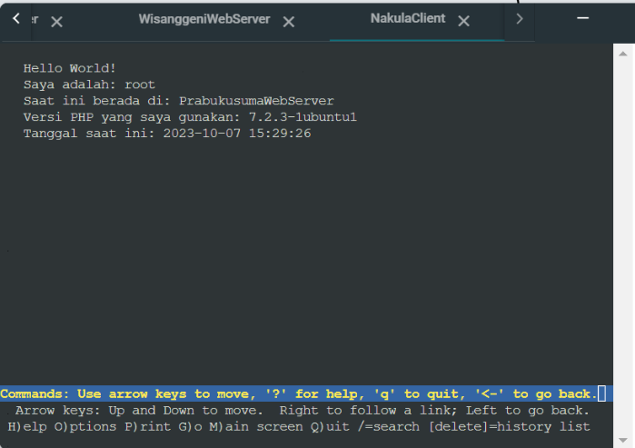

<h1> Jarkom-Modul-2-E13-2023 </h1>

E13

5025211239
Najma Ulya Agustina

5025201015
NADYA PERMATA SARI

<h2>Daftar Isi</h2>

- [Soal 1](#soal-1)  
	- [Solusi](#solusi1)
	- [Testing](#testing1)
- [Soal 2](#soal-2)  
	- [Solusi](#solusi2)
	- [Testing](#testing2)
- [Soal 3](#soal-3)  
- [Soal 4](#soal-4)  
- [Soal 5](#soal-5)  
- [Soal 6](#soal-6)  
- [Soal 7](#soal-7)  
- [Soal 8](#soal-8)  
- [Soal 9](#soal-9)  
- [Soal 10](#soal-10)  
- [Soal 11](#soal-11)  
- [Soal 12](#soal-12)  
- [Soal 13](#soal-13)  
- [Soal 14](#soal-14)  
- [Soal 15](#soal-15)  
- [Soal 16](#soal-16)  
- [Soal 17](#soal-17)  
- [Soal 18](#soal-18)  
- [Soal 19](#soal-19)  
	- [Solusi](#solusi)
	- [Testing](#testing)
- [Soal 20](#soal-20)  
- [Kendala](#kendala)

Prefix IP Kelompok E13: 10.43

<h3>Soal 1</h3>
Yudhistira akan digunakan sebagai DNS Master, Werkudara sebagai DNS Slave, Arjuna merupakan Load Balancer yang terdiri dari beberapa Web Server yaitu Prabakusuma, Abimanyu, dan Wisanggeni. Buatlah topologi dengan pembagian sebagai berikut. Folder topologi dapat diakses pada drive berikut.

<h4>Solusi</h4>
Kelompok E13 mendapatkan Topologi 08 sebagai berikut:

Hasil topologi yang telah dibuat adalah:

>>Konfigurasi network:

- Router:
  
Konfigurasi pada router

	auto eth0
	iface eth0 inet dhcp

	auto eth1
	iface eth1 inet static

	address 10.43.1.1
	netmask 255.255.255.0

	auto eth2
	iface eth2 inet static

	address 10.43.2.1
	netmask 255.255.255.0
 

- NakulaClient

Konfigurasi pada NakulaClient

	auto eth0
	iface eth0 inet static

	address 10.43.1.2
	netmask 255.255.255.0
	gateway 10.43.1.1
 

- SadewaClient

Konfigurasi pada SadewaClient

	auto eth0
	iface eth0 inet static

	address 10.43.1.3
	netmask 255.255.255.0
	gateway 10.43.1.1

- AbimanyuWebServer

Konfigurasi pada AbimanyuWebServer

	auto eth0
	iface eth0 inet static

	address 10.43.1.4
	netmask 255.255.255.0
	gateway 10.43.1.1
 

- PrabukusumaWebServer

Konfigurasi pada PrabukusumaWebServer

	auto eth0
	iface eth0 inet static

	address 10.43.1.5
	netmask 255.255.255.0
	gateway 10.43.1.1

- WisanggeniWebServer

Konfigurasi pada  WisanggeniWebServer

	auto eth0
	iface eth0 inet static

	address 10.43.1.6
	netmask 255.255.255.0
	gateway 10.43.1.1

- YudhistiraDNSMaster
  
Konfigurasi pada  YudhistiraDNSMaster

	auto eth0
	iface eth0 inet static

	address 10.43.2.2
	netmask 255.255.255.0
	gateway 10.43.2.1
 

- WerkudaraDNSSlave

Konfigurasi pada WerkudaraDNSSlave

	auto eth0
	iface eth0 inet static

	address 10.43.2.3
	netmask 255.255.255.0
	gateway 10.43.2.1
 

- ArjunaLoadBalancer
  
Konfigurasi pada ArjunaLoadBalancer

	auto eth0
	iface eth0 inet static

	address 10.43.2.4
	netmask 255.255.255.0
	gateway 10.43.2.1
 
- Mengedit /root/.bashrc :

Router

	iptables -t nat -A POSTROUTING -o eth0 -j MASQUERADE -s 10.43.0.0/16

YudhistiraDNSMaster

	echo 'nameserver 192.168.122.1' > /etc/resolv.conf
	apt-get update
	apt-get install bind9 -y
	service bind9 restart  
	mkdir /etc/bind/arjuna    
	mkdir /etc/bind/abimanyu

WerkudaraDNSSlave

	echo 'nameserver 192.168.122.1' > /etc/resolv.conf
	apt-get update
	apt-get install bind9 -y
	service bind9 restart 

NakulaClient & SadewaClient

	echo -e '
	nameserver 10.43.2.2 # IP Yudhistira
	nameserver 10.43.2.3 # IP Werkudara
	nameserver 192.168.122.1
	' > /etc/resolv.conf
	apt-get update
	apt-get install dnsutils -y
	apt-get install lynx -y

ArjunaLoadBalancer

	echo 'nameserver 192.168.122.1' > /etc/resolv.conf
	apt-get update
	apt-get install dnsutils -y
	apt-get install lynx -y
	apt-get install bind9 nginx -y
	service nginx start

AbimanyuWebServer, PrabukusumaWebserver, WisanggeniWebServer

	echo nameserver 192.168.122.1 > /etc/resolv.conf
	apt-get update
	apt install nginx php php-fpm -y
	php -v

<h4>Testing</h4>

<h3>Soal 2</h3>
Buatlah website utama dengan akses ke arjuna.yyy.com dengan alias www.arjuna.yyy.com dengan yyy merupakan kode kelompok.

<h4>Solusi</h4>

>>Di DNS Master yudhis:

		 apt-get update
	 	apt-get install bind9 -y

- Cd root/ dulu kemudian nano makedomain.sh

		echo ‘zone "arjuna.e13.com" {
		type master;
		file "/etc/bind/jarkom/arjuna.e13.com";
		};’ >> /etc/bind/named.conf.local

- Membuat directory baru dengan nama "jarkom"

		mkdir /etc/bind/jarkom
  
- Copy file /etc/bind/db.local ke /etc/bind/jarkom/arjuna.e13.com

		cp /etc/bind/db.local /etc/bind/jarkom/arjuna.e13.com

- Membuat file arjuna.e13.com di dalam directory jarkom

		nano /etc/bind/jarkom/arjuna.e13.com
  
  
  
- Merestart bind9

		service bind9 restart

- Di NakulaClient:

Kalau belom → echo nameserver 192.168.122.1 > /etc/resolv.conf

	apt-get update  
	apt-get install dnsutils -y  
	echo "nameserver 10.43.2.2" > /etc/resolv.conf 
	ping arjuna.e13.com
	ping www.arjuna.e13.com
	host -t CNAME www.arjuna.e13.com

<h4>Testing</h4>

<h3>Soal 3</h3>
Dengan cara yang sama seperti soal nomor 2, buatlah website utama dengan akses ke abimanyu.yyy.com dan alias www.abimanyu.yyy.com.

>>Di DNS Master yudhis:

	apt update
	apt install bind9 -y

makedomain.sh

	echo ‘zone "abimanyu.e13.com" {
	type master;
	file "/etc/bind/jarkom/abimanyu.e13.com";
	};’ >> /etc/bind/named.conf.local

- Mengcopy /etc/bind/db.local ke /etc/bind/jarkom/abimanyu.e13.com

		cp /etc/bind/db.local /etc/bind/jarkom/abimanyu.e13.com
  
  
  
- Membuat file abimanyu.e13.com dalam directory jarkom

		nano /etc/bind/jarkom/abimanyu.e13.com
  
- Merestart bind9 agar file konfigurasi dapat tersimpan

		service bind9 restart

- Di NakulaClient:

		apt-get update  
		apt-get install dnsutils -y  
		echo "nameserver 10.43.2.2" > /etc/resolv.conf 
		ping abimanyu.e13.com
		ping www.abimanyu.e13.com
		host -t CNAME www.abimanyu.e13.com

<h3>Soal 4</h3>
Kemudian, karena terdapat beberapa web yang harus di-deploy, buatlah subdomain parikesit.abimanyu.yyy.com yang diatur DNS-nya di Yudhistira dan mengarah ke Abimanyu.

nano /etc/bind/jarkom/jarkom

>>Pada Yudhistira:

- edit file /etc/bind/jarkom/arjuna.e13.com lalu tambahkan subdomain untuk arjuna.e13.com yang mengarah ke IP Abimanyu
- Restart service bind
- Ping ke subdomain dari PrabukusumaWebServer

<h3>Soal 5</h3>
Buat juga reverse domain untuk domain utama. (Abimanyu saja yang direverse)

<h3>Soal 6</h3>
Agar dapat tetap dihubungi ketika DNS Server Yudhistira bermasalah, buat juga Werkudara sebagai DNS Slave untuk domain utama.

   
>>Yudhistira:

- Membuka file /etc/bind/named.conf.local
	
			nano /etc/bind/named.conf.local
	
			zone "arjuna.e13.com" {
	    		type master;
	   		 notify yes;
	   		 also-notify { 10.43.2.3; }; //IP Werkudara
	    		allow-transfer { 10.43.2.3; }; //IP Werkudara
	    		file "/etc/bind/jarkom/arjuna.e13.com";
			};
	
			zone "abimanyu.e13.com" {
	   		 type master;
	   		 notify yes;
	    		also-notify { 10.43.2.3; }; //IP Werkudara
	    		allow-transfer { 10.43.2.3; }; //IP Werkudara
	    		file "/etc/bind/jarkom/abimanyu.e13.com";
				};

- Merestart bind9
  
		service bind9 restart

>>Werkudara:

	echo nameserver 192.168.122.1 > /etc/resolv.conf 
	apt-get update
	apt-get install bind9 -y

 - Membuka file /etc/bind/named.conf.local

		nano /etc/bind/named.conf.local

lalu tambahkan:

	zone "arjuna.e13.com" {
    type slave;
    masters { 10.43.2.2; }; // IP Yudhistira
    file "/var/lib/bind/abimanyu.e13.com";
	};

	zone "abimanyu.e13.com" {
    type slave;
    masters { 10.43.2.2; }; // IP Yudhistira
    file "/var/lib/bind/abimanyu.e13.com";
	};
 
- Restart bind9
  
		service bind9 restart

>Yudhistira:

- Matika bind9 pada yudhistira
  
		service bind9 stop

>>NakulaClient:

-Cek nameserver
-ping web webnya

<h3>Soal 7</h3>
Seperti yang kita tahu karena banyak sekali informasi yang harus diterima, buatlah subdomain khusus untuk perang yaitu baratayuda.abimanyu.yyy.com dengan alias www.baratayuda.abimanyu.yyy.com yang didelegasikan dari Yudhistira ke Werkudara dengan IP menuju ke Abimanyu dalam folder Baratayuda.

>>Yudhistira:

- Membuka file /etc/bind/jarkom/abimanyu.e13.com

		nano /etc/bind/jarkom/abimanyu.e13.com

  
  
- Membuka file /etc/bind/named.conf.options

		nano /etc/bind/named.conf.options
  
lalu lakukan konfigurasi:

comment dnssec-validation auto; dan tambahkan baris berikut pada /etc/bind/named.conf.options

	nano /etc/bind/named.conf.local
	zone "abimanyu.e13.com" {
        type master;
        //notify yes;
        //also-notify {10.45.2.3;};  
        allow-transfer {10.43.2.3;}; // IP Werkudara
        file "/etc/bind/jarkom/abimanyu.e13.com";
	};

- Restart bind9 untuk menyimpan konfigurasi
  
		service bind9 restart

>>Werkudara:

- Membuka file  /etc/bind/named.conf.options
  
		nano /etc/bind/named.conf.options
  
comment dnssec-validation auto; dan tambahkan baris berikut pada /etc/bind/named.conf.options

	nano /etc/bind/named.conf.local
	zone "baratayuda.abimanyu.e13.com"{  
        type master;
        file "/etc/bind/Baratayuda/baratayuda.abimanyu.e13.com";
	};  

- Membuat directory Baratayuda
  
		mkdir /etc/bind/Baratayuda

- Mencopy file /etc/bind/db.local ke  /etc/bind/Baratayuda/baratayuda.abimanyu.e13.com
  
		cp /etc/bind/db.local /etc/bind/Baratayuda/baratayuda.abimanyu.e13.com

- Membuka file abimanyu.e13.com dalam directory /etc/bind/Baratayuda/baratayuda
  
		nano /etc/bind/Baratayuda/baratayuda.abimanyu.e13.com
  
  
  
- Restart bind9

		service bind9 restart

>>NakulaClient:

	ping baratayuda.abimanyu.e13.com
	ping www.baratayuda.abimanyu.e13.com
	

<h3>Soal 8</h3>
Untuk informasi yang lebih spesifik mengenai Ranjapan Baratayuda, buatlah subdomain melalui Werkudara dengan akses rjp.baratayuda.abimanyu.yyy.com dengan alias www.rjp.baratayuda.abimanyu.yyy.com yang mengarah ke Abimanyu.

   
   
>>Werkudara:

	nano /etc/bind/Baratayuda/baratayuda.abimanyu.e13.com
 
 

	service bind9 restart

>>NakulaClient:

	host -t CNAME www.rjp.baratayuda.abimanyu.e13.com
	ping rjp.baratayuda.abimanyu.e13.com -c 5
	ping www.rjp.baratayuda.abimanyu.e13.com -c 5
	host -t A rjp.baratayuda.abimanyu.e13.com

<h3>Soal 9</h3>
Arjuna merupakan suatu Load Balancer Nginx dengan tiga worker (yang juga menggunakan nginx sebagai webserver) yaitu Prabakusuma, Abimanyu, dan Wisanggeni. Lakukan deployment pada masing-masing worker.

>>LB ARJUNA

	echo nameserver 192.168.122.1 > /etc/resolv.conf
	apt-get update
	apt-get install bind9 nginx -y

 - Membuka file jarkom

		nano /etc/nginx/sites-available/jarkom
lalu tambahkan:

	upstream myweb {
  	server 10.43.1.4; # IP Abimanyu
	  server 10.43.1.5; # IP Prabukusuma
	  server 10.43.1.6; # IP Wisanggeni
	}
	
	server {
	  listen 80;
  	server_name arjuna.e13.com www.arjuna.e13.com;

  	location / {
    proxy_pass http://myweb;
  	}
	}

- Lakukan symlink
  
		ln -s /etc/nginx/sites-available/jarkom /etc/nginx/sites-enabled/jarkom

- Menghapus /etc/nginx/sites-enabled/default

		rm /etc/nginx/sites-enabled/default

- Restart nginx
  
		service nginx restart

- Mengecek apakah konfigurasi sudah dilakukan dengan benar
  
		nginx -t

>>WORKER

	echo nameserver 192.168.122.1 > /etc/resolv.conf
	apt-get update
	apt install nginx php php-fpm -y
	php -v
 
 - Membuat directory jarkom pada /var/www
   
		mkdir /var/www/jarkom

 - Membuat file baru index.php pada /var/www/jarkom
   
		nano /var/www/jarkom/index.php
   Dan tambahkan:

		<?php
		$hostname = gethostname();
		$date = date('Y-m-d H:i:s');
		$php_version = phpversion();
		$username = get_current_user();

		echo "Hello World! ";
		echo "Saya adalah: $username ";
		echo "Saat ini berada di: $hostname ";
		echo "Versi PHP yang saya gunakan: $php_version ";
		echo "Tanggal saat ini: $date ";
		?>

- Me run php
  
		service php7.2-fpm start
  
- Membuka file /etc/nginx/sites-available/jarkom
  
		nano /etc/nginx/sites-available/jarkom
  
  Lalu tambahkan:
  
		server {
        listen 80;

        root /var/www/jarkom;
        index index.php index.html index.htm index.nginx-debian.html;

        server_name _;

        location / {
                try_files $uri $uri/ /index.php?$query_string;
        }

        location ~ \.php$ {
                include snippets/fastcgi-php.conf;
                fastcgi_pass unix:/run/php/php7.2-fpm.sock;
        }

        location ~ /\.ht {
                deny all;
        }
		}
- Lakukan Symlink

		ln -s /etc/nginx/sites-available/jarkom /etc/nginx/sites-enabled/jarkom
  
- Menghapus file /etc/nginx/sites-enabled/default

		rm /etc/nginx/sites-enabled/default
- Restart bind9

		service nginx restart
  
- Mengecek konfigurasi
  
		nginx -t

>>Nakula:

	echo nameserver 192.168.122.1 > /etc/resolv.conf
	apt-get update
	apt-get install lynx -y
	GAUSA apt-get install php -y
	nano /etc/resolv.conf
	nameserver 10.43.2.2 # IP Yudhistira
	nameserver 10.43.2.3 # IP Werkudara

lynx http://10.43.1.4

lynx http://10.43.1.5

lynx http://10.43.1.6

<h3>Soal 10</h3>
Kemudian gunakan algoritma Round Robin untuk Load Balancer pada Arjuna. Gunakan server_name pada soal nomor 1. Untuk melakukan pengecekan akses alamat web tersebut kemudian pastikan worker yang digunakan untuk menangani permintaan akan berganti ganti secara acak. Untuk webserver di masing-masing worker wajib berjalan di port 8001-8003. Contoh
    - Prabakusuma:8001
    - Abimanyu:8002
    - Wisanggeni:8003

      

NOMER 10 – sebenernya nomer 9 tp ganti beberapa dikit

>>LB ARJUNA

- Membuka file  /etc/nginx/sites-available/jarkom
  
		nano /etc/nginx/sites-available/jarkom
  Lalu tambahkan:
  
		 # Default menggunakan Round Robin
		 upstream myweb  {
 		server 10.43.1.4:8001; #IP Abimanyu
 		server 10.43.1.5:8002; #IP Prabukusuma
		server 10.43.1.6:8003; #IP Wisanggeni
 		}

		 server {
	 	listen 80;
	 	server_name arjuna.e13.com www.arjuna.e13.com;
	
	 	location / {
	 	proxy_pass http://myweb;
			 	}
			 }
		
		service nginx restart
		nginx -t
		
		DIII WORKERR
		nano /etc/nginx/sites-available/jarkom
		server {
		        listen 80;
	
	        root /var/www/jarkom;
	        index index.php index.html index.htm index.nginx-debian.html;
	
	        server_name _;
	
	        location / {
	                try_files $uri $uri/ /index.php?$query_string;
	        }
	
	        location ~ \.php$ {
	                include snippets/fastcgi-php.conf;
	                fastcgi_pass unix:/run/php/php7.2-fpm.sock;
	        }
	
	        location ~ /\.ht {
	                deny all;
	        }
		}

- Restart nginx
  
		service nginx restart
  
- Mengecek konfigurasi
  
		nginx -t

>>Nakula:

	echo nameserver 192.168.122.1 > /etc/resolv.conf
	apt-get update
	apt-get install lynx -y
	GAUSA apt-get install php -y
	nano /etc/resolv.conf
	nameserver 10.43.2.2 # IP Yudhistira
	nameserver 10.43.2.3 # IP Werkudara

lynx http://10.43.1.4
lynx http://10.43.1.5
lynx http://10.43.1.6
lynx http://10.43.2.4
lynx http://arjuna.e13.com

<h3>Soal 11</h3>

<h3>Soal 12</h3>

<h3>Soal 13</h3>

<h3>Soal 14</h3>

<h3>Soal 15</h3>

<h3>Soal 16</h3>

<h3>Soal 17</h3>

<h3>Soal 18</h3

<h4>Solusi</h4>
<h4>Testing</h4>

<h3>Soal 19</h3>

<h3>Soal 20</h3>

